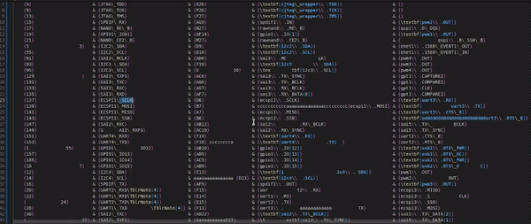

# TableFormatter v0.0.4

TableFormatter is a versatile tool to write Toradex Hardware Documentation. 
The main feature is formatting and navigation commands for Toradex tables. 
TableFormatter also includes some snippets for common used expressions and auto-completion for internal reference sections and external files inside the documetation.

## Features

- **Efficient Formatting**: Easily format your data into neatly organized tables with just a single command.
- **Efficient Editing**   : Faster navigate inside the tables with arrows keys
- **Efficient Writting**  : Use snippets and auto-completion to 

## Installation

Install from the vscode extensions store

## How to Use

### Shortcuts
- **Ctrl + T**
  - Format tables in LaTeX documents.
  - Note that the table must be **validaded** (fully working) before using the command.

  

- **Ctrl + B**
  - Bold text in LaTeX or Markdown documents.
  - 
  

- **Ctrl + I**
  - Italicize text in LaTeX or Markdown documents.

- **Ctrl + G**
  - Insert a grey text tag in LaTeX or Markdown documents.

- **Alt + S**
  - Select the nearest cell text in LaTeX documents.

### Table Navigation
1. Use ```Alt + S``` to select a cell.

  


1. Move between cells using the arrow keys.

### Snippets and auto-completion
- Start typing ```\``` to see some common used latex commands
- Type ```{``` to get some auto-completion suggestions


# Contributing
We welcome contributions from the community! If you have any ideas for improvements or new features, feel free to open an issue or submit a pull request.

Before contributing, please make sure to read our contribution guidelines.

# License
This project is licensed under the MIT License - see the LICENSE file for details.